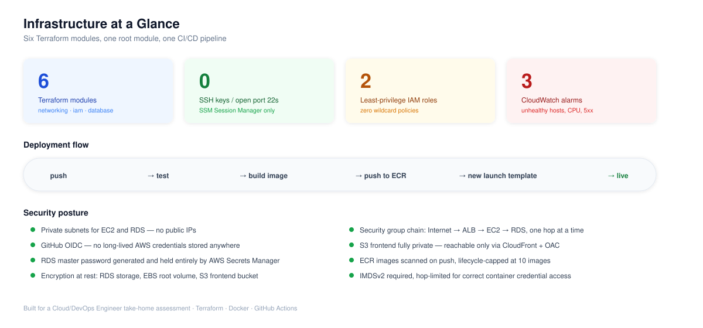
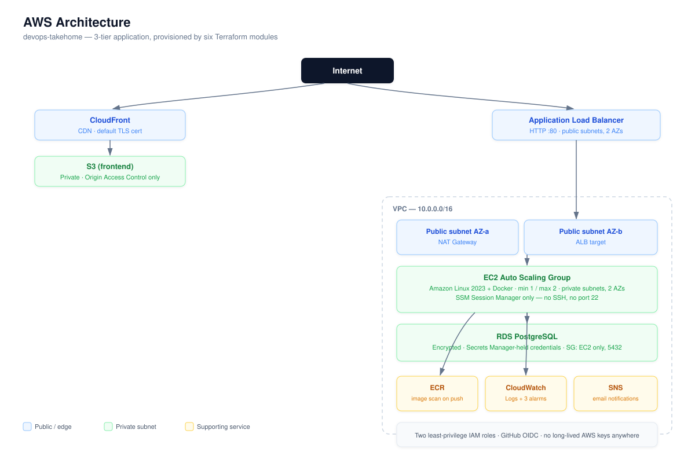
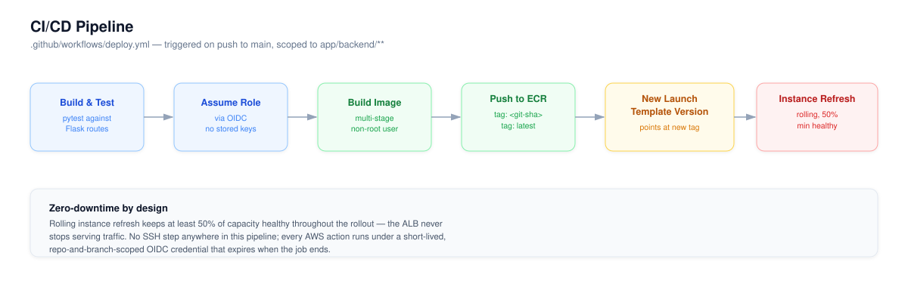
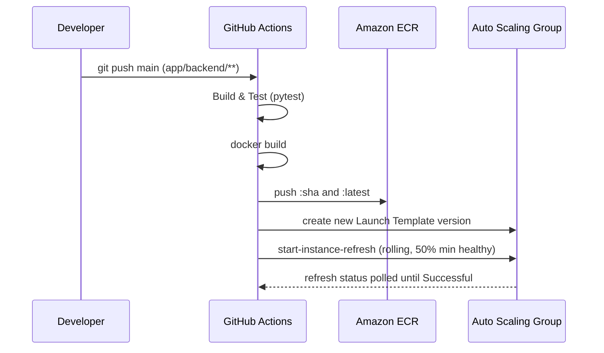
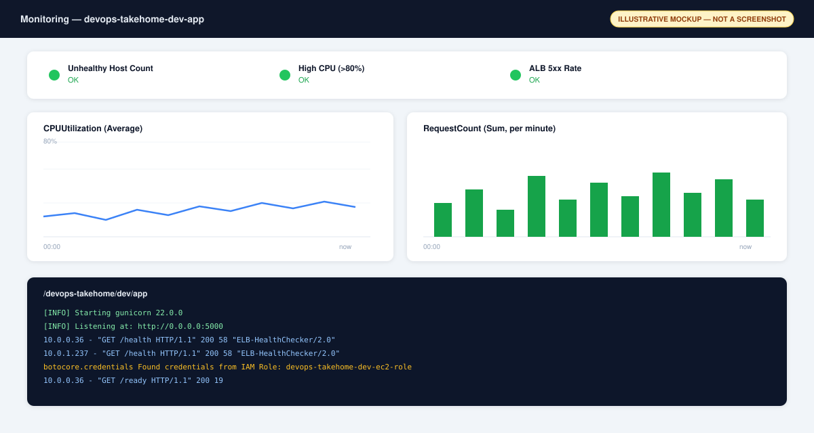
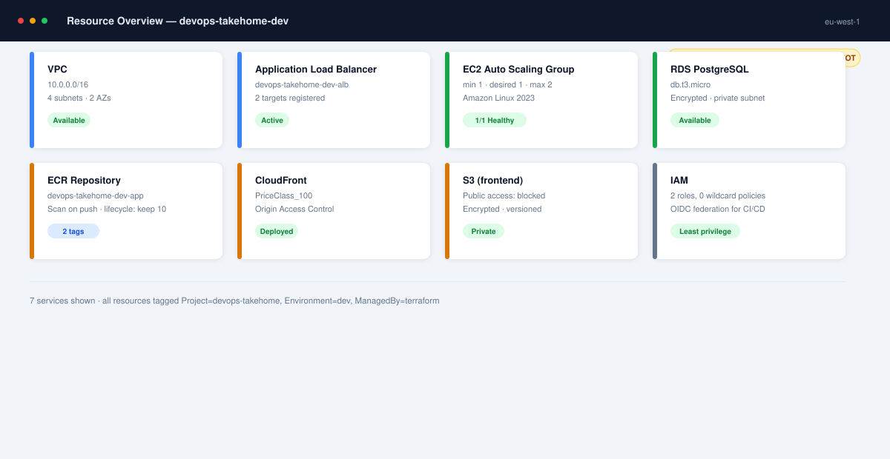
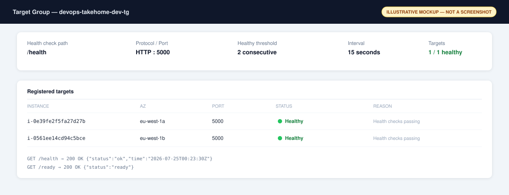

<div align="center">

# devops-takehome

**A production-shaped 3-tier web application on AWS — provisioned with Terraform, containerized with Docker, and shipped through a zero-downtime GitHub Actions pipeline.**

[](https://www.terraform.io/)
[](https://aws.amazon.com/)
[](https://www.docker.com/)
[](https://www.python.org/)
[](https://github.com/features/actions)
[](LICENSE)

</div>

<br>



<br>

## Table of Contents

- [Project Highlights](#project-highlights)
- [Overview](#overview)
- [Architecture](#architecture)
- [Repository Structure](#repository-structure)
- [CI/CD Pipeline](#cicd-pipeline)
- [Security](#security)
- [Monitoring](#monitoring)
- [Deployment](#deployment)
- [Cost Optimization](#cost-optimization)
- [Assumptions & Limitations](#assumptions--limitations)
- [Troubleshooting](#troubleshooting)
- [Lessons Learned](#lessons-learned)
- [Future Improvements](#future-improvements)

---

## Project Highlights

- Provisioned a real, working AWS environment — VPC, ALB, Auto Scaling Group, RDS PostgreSQL, ECR, CloudFront, S3, IAM, CloudWatch, SNS — with a verified end-to-end health check chain (`/health` and `/ready` both returning `200` through the full stack)
- Built a GitHub Actions pipeline that authenticates to AWS via **OIDC federation** — zero long-lived credentials stored anywhere — verified with a fully green run (test → build → push → deploy)
- Applied **least-privilege IAM** throughout: two purpose-built roles, zero wildcard `*:*` policies
- Diagnosed and fixed **8 real production issues** that only surface once you actually run `terraform apply` against live AWS — documented in [Troubleshooting](#troubleshooting), not glossed over
- **Technologies used:** Terraform · AWS (VPC, EC2 Auto Scaling, ALB, RDS, ECR, S3, CloudFront, IAM, CloudWatch, SNS, SSM, Secrets Manager) · Docker · Python / Flask · GitHub Actions · OIDC · Gunicorn · pytest

---

## Overview

A Flask backend, PostgreSQL database, and static frontend, running on AWS behind an Application Load Balancer and CloudFront — provisioned entirely through modular Terraform and shipped by a pipeline that never stores an AWS credential.

Built as a Cloud/DevOps Engineer take-home assessment, scoped for a 4–6 hour build. Every decision here is one that would hold up outside the assessment too.

| | |
|---|---|
| **Compute** | EC2 (Amazon Linux 2023) in an Auto Scaling Group behind an ALB |
| **Container registry** | Amazon ECR, image-scanned on push |
| **Database** | RDS PostgreSQL, credentials generated and held by Secrets Manager |
| **Frontend delivery** | Private S3 + CloudFront with Origin Access Control |
| **Access model** | SSM Session Manager only |
| **CI/CD auth** | GitHub OIDC → short-lived AWS credentials |
| **Observability** | CloudWatch Logs, 3 metric alarms, SNS email notifications |

---

## Architecture




<details>
<summary><b>Why it's shaped this way</b></summary>
<br>

- EC2 and RDS sit in private subnets, reachable only through the ALB — nothing in the compute or data tier has a public IP.
- A single NAT Gateway handles outbound traffic from private subnets — a deliberate cost trade-off (see [Cost Optimization](#cost-optimization)).
- The app resolves DB connection info at runtime via SSM Parameter Store rather than baked-in Launch Template values, which keeps the template static and avoids a circular Terraform dependency between the `compute` and `database` modules.

</details>

---

## Repository Structure

```text
terraform/
├── modules/
│   ├── networking/    VPC, 2 public + 2 private subnets, IGW, single NAT
│   ├── iam/            EC2 role (SSM + scoped ECR/CloudWatch) + GitHub OIDC role
│   ├── database/       RDS PostgreSQL, SG locked to EC2 only, SSM discovery params
│   ├── compute/        ALB, security groups, Launch Template, Auto Scaling Group
│   ├── monitoring/     Log group, SNS topic, CloudWatch alarms
│   └── frontend/       Private S3 + CloudFront (Origin Access Control)
└── environments/
    └── dev/             Root module — wires the six modules, owns the ECR repo

app/backend/             Flask app, Dockerfile, tests
.github/workflows/       deploy.yml — build, test, ship
docs/images/              Diagrams and illustrative mockups used in this README
LICENSE                  MIT
```

Each module owns exactly one AWS concern and exposes only what the next module needs — `networking` never knows compute exists; `iam` only knows the one ECR ARN it needs to scope permissions to. The root module is the single place anything gets wired together.

---

## CI/CD Pipeline





`permissions: id-token: write` lets GitHub mint a short-lived OIDC token for each run, which `aws-actions/configure-aws-credentials` exchanges for temporary AWS credentials by assuming a role scoped to this exact repository and the `main` branch — a fork or PR branch cannot assume it, and nothing is ever stored in GitHub Secrets.

---

## Security

| Control | Implementation |
|---|---|
| Instance access | SSM Session Manager only — no SSH, no port 22, no key pairs |
| Network segmentation | EC2 and RDS in private subnets, no public IPs |
| Security group chain | Internet → ALB → EC2 → RDS, one hop and one port at a time |
| IAM | Two purpose-built roles, least-privilege, zero wildcard `*:*` policies |
| Encryption at rest | RDS storage, EBS root volume, S3 frontend bucket |
| Frontend access | S3 fully private; CloudFront reaches it via Origin Access Control |
| Secrets | RDS master password generated and held entirely by Secrets Manager — Terraform state never contains it |

---

## Monitoring



CloudWatch Agent ships application logs and `mem`/`disk` metrics from every instance. Three alarms, all notifying a single SNS topic by email: unhealthy target count on the ALB target group, high CPU across the Auto Scaling Group, and elevated 5xx rate at the load balancer.

---

## Deployment



<details open>
<summary><b>1. Provision the infrastructure</b></summary>
<br>

```bash
cd terraform/environments/dev
cp terraform.tfvars.example terraform.tfvars
# edit terraform.tfvars — set github_repo ("org/repo") and alarm_email
terraform init
terraform plan
terraform apply
```

Confirm the SNS email subscription in your inbox so alarms actually arrive.

</details>

<details>
<summary><b>2. Push the first image</b></summary>
<br>

```bash
aws ecr get-login-password --region <region> | \
  docker login --username AWS --password-stdin <account>.dkr.ecr.<region>.amazonaws.com
docker build -t <ecr_repository_url>:latest app/backend
docker push <ecr_repository_url>:latest
```

</details>

<details>
<summary><b>3. Configure GitHub Actions</b></summary>
<br>

Repo → **Settings → Secrets and variables → Actions → Variables** (resource identifiers, not secrets):

| Variable | Source |
|---|---|
| `AWS_REGION` | e.g. `eu-west-1` |
| `AWS_DEPLOY_ROLE_ARN` | `terraform output github_deploy_role_arn` |
| `ECR_REPOSITORY_URL` | `terraform output ecr_repository_url` |
| `LAUNCH_TEMPLATE_ID` | `terraform output launch_template_id` |
| `ASG_NAME` | `terraform output autoscaling_group_name` |

</details>

<details>
<summary><b>4. Ship a change</b></summary>
<br>

Push to `main` touching `app/backend/` — the pipeline builds, tests, pushes an image tagged with the Git SHA, cuts a new Launch Template version, and rolls the ASG through a zero-downtime Instance Refresh.

```bash
terraform output alb_dns_name   # curl this + /health to verify
```

</details>

<details>
<summary><b>5. Tear down</b></summary>
<br>

```bash
terraform destroy
```

</details>

**Health check proof:**



**Run locally:**

```bash
cd app/backend
python3 -m venv venv && source venv/bin/activate
pip install -r requirements-dev.txt
pytest -v
python app.py   # http://localhost:5000
```

```bash
docker build -t devops-takehome-app:local app/backend
docker run --rm -p 5000:5000 devops-takehome-app:local
curl http://localhost:5000/health
```

---

## Cost Optimization

| Choice made here | Production alternative |
|---|---|
| Single NAT Gateway | One NAT Gateway per AZ (~2× cost, removes single point of failure) |
| Single-AZ RDS (`multi_az = false`) | `multi_az = true` for automatic failover |
| `db.t3.micro` | Sized to actual load, with RDS Proxy if connection counts grow |
| ECR lifecycle policy caps stored images at 10 | Already production-appropriate |
| CloudFront `PriceClass_100` | `PriceClass_All` once traffic isn't regionally concentrated |
| Local Terraform state | S3 + DynamoDB remote backend for team use and CI locking |

---

## Assumptions & Limitations

**Assumptions:**
- An AWS account/sandbox with sufficient service quotas in the target region
- A GitHub repository already exists to receive the OIDC trust relationship
- Terraform ≥ 1.7 and AWS CLI configured locally for the initial provisioning steps

**Limitations:**
- Frontend CI/CD isn't wired up — the `frontend` module provisions S3 + CloudFront, but syncing built assets and invalidating the cache is still a manual step
- Single NAT Gateway and single-AZ RDS are cost-optimized, not HA-ready, out of the box
- No custom domain or ACM certificate — the ALB listener serves plain HTTP
- Local Terraform state is fine for solo use, not safe for concurrent or team applies
- Unit tests only — no integration test against a live Postgres instance

---

## Troubleshooting

Real issues hit and fixed while actually running `terraform apply` and the CI/CD pipeline against live AWS — not hypothetical:

| Symptom | Root cause | Fix |
|---|---|---|
| `InvalidParameterValue: Character sets beyond ASCII are not supported` creating security groups | SG `description` fields only accept ASCII | Replaced em dashes with plain hyphens |
| `InvalidParameterCombination: Cannot find version X for postgres` | Hardcoded RDS engine version not available in this region/account | Auto-discover via `data "aws_rds_engine_version"` instead of pinning a version |
| SSM Session Manager never connects (`TargetNotConnected`) | `amazon-ssm-agent` isn't pre-installed on this AMI build | `dnf install -y amazon-ssm-agent` before enabling the service |
| `/ready` returns `db_config_unavailable` | IMDSv2 `http_put_response_hop_limit = 1` blocks containerized processes from reaching instance metadata | Set `http_put_response_hop_limit = 2` |
| CloudWatch Logs empty despite the app running fine | App logs to stdout; CloudWatch Agent was configured to tail a file the app never writes | Ship container stdout via Docker's `awslogs` log driver instead |
| ECR push fails: `tag ... is immutable` | Repository was `IMMUTABLE`, but the pipeline intentionally overwrites the `latest` tag every deploy | Switched to `image_tag_mutability = "MUTABLE"` |
| GitHub Actions OIDC `AccessDenied` on a brand-new repo | GitHub's July 2026 rollout of immutable OIDC subject claims (`repo:owner@id/repo@id:...`) | Trust policy matches both the legacy and immutable claim formats via `StringLike` |
| `AccessDenied ... not authorized to use launch template` | Associating a Launch Template with an ASG needs `ec2:RunInstances`, `ec2:CreateTags`, and `iam:PassRole` in addition to the Auto Scaling permissions | Added all three to the CI/CD role |

---

## Lessons Learned

`terraform validate` and `terraform plan` catch syntax and type errors — they don't catch region-specific engine versions, AMI package availability, IMDS hop-limit behavior inside containers, or a platform vendor shipping a breaking change to its OIDC token format the same week you build against it. Every issue in the table above only surfaced once the infrastructure was actually applied and the pipeline actually ran end to end. Building the fix into the Terraform source rather than working around it by hand is what makes the pipeline trustworthy for the next deploy, not just the first one.

---

## Future Improvements

- Blue/green or canary deploys in place of the current rolling Instance Refresh
- ACM certificate + Route 53 domain, redirecting the ALB's HTTP listener to HTTPS
- Wire the frontend build into CI/CD (`aws s3 sync` + CloudFront invalidation)
- Target-tracking scaling policy instead of the current static `min=1 / max=2` sizing
- Integration tests against a real Postgres instance

---

<div align="center">

Built as part of a Cloud/DevOps Engineer take-home assessment · Terraform · Docker · GitHub Actions

</div>
