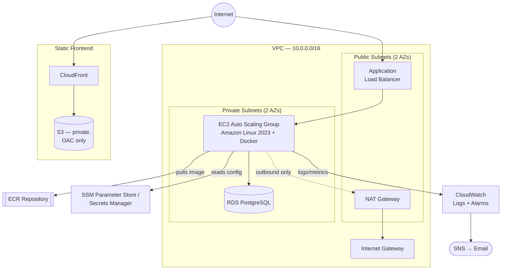
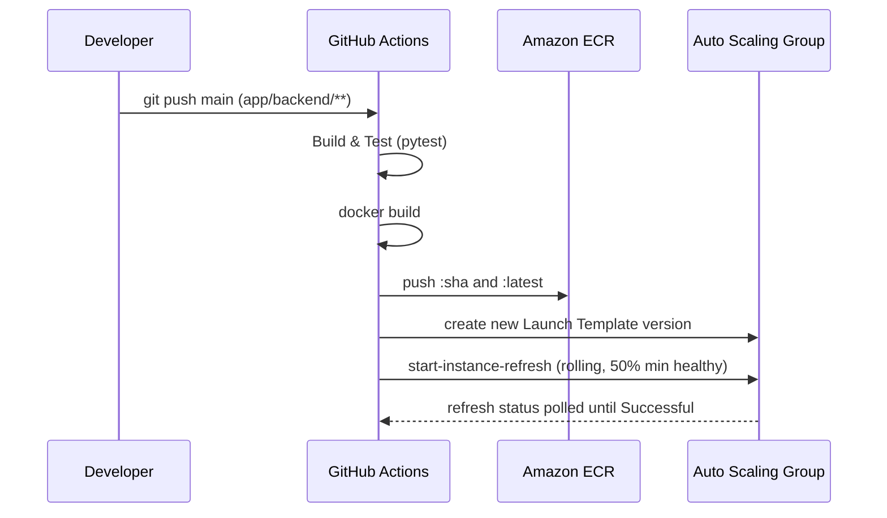

<div align="center">

# DevOps Take-Home Assessment

**A production-shaped 3-tier web application on AWS — Terraform, Docker, and GitHub Actions, built module by module.**

[](https://www.terraform.io/)
[](https://aws.amazon.com/)
[](https://www.docker.com/)
[](https://www.python.org/)
[](https://github.com/features/actions)
[](#)

</div>

---

## Overview

A Flask backend, PostgreSQL database, and static frontend, deployed on AWS
behind an Application Load Balancer and CloudFront — provisioned entirely
through modular Terraform and shipped via a GitHub Actions pipeline that
authenticates to AWS with no stored credentials.

This repository is the output of a Cloud/DevOps take-home assessment. It's
scoped for a 4–6 hour build, but every infrastructure decision below is one
that would hold up in a real environment: least-privilege IAM, no SSH
surface, encrypted storage, and a rolling zero-downtime deployment strategy.

| | |
|---|---|
| **Compute** | EC2 (Amazon Linux 2023) in an Auto Scaling Group behind an ALB |
| **Container registry** | Amazon ECR, image-scanned on push |
| **Database** | RDS PostgreSQL, RDS-managed credentials via Secrets Manager |
| **Frontend delivery** | S3 (private) + CloudFront with Origin Access Control |
| **Access model** | SSM Session Manager only — no SSH, no port 22, anywhere |
| **CI/CD auth** | GitHub OIDC → short-lived AWS role assumption, zero stored keys |
| **Observability** | CloudWatch Logs, 3 metric alarms, SNS email notifications |

---

## Architecture



<details>
<summary><b>Static diagram (SVG, no JS required)</b></summary>
<br>

See [`docs/architecture.svg`](docs/architecture.svg) for a rendered,
presentation-ready version of the same diagram.

</details>

---

## Repository Layout

```text
terraform/
├── modules/
│   ├── networking/    VPC, 2 public + 2 private subnets, IGW, single NAT
│   ├── iam/            EC2 role (SSM + scoped ECR/CloudWatch) + GitHub OIDC role
│   ├── database/       RDS PostgreSQL, SG locked to EC2 only, SSM discovery params
│   ├── compute/        ALB, security groups, Launch Template, Auto Scaling Group
│   ├── monitoring/     Log group, SNS topic, CloudWatch alarms
│   └── frontend/       Private S3 + CloudFront (Origin Access Control)
└── environments/
    └── dev/             Root module — wires the six modules, owns the ECR repo

app/backend/             Flask app, Dockerfile, tests
.github/workflows/       deploy.yml — build, test, ship
docs/                    architecture.svg
```

<details>
<summary><b>Why modules are structured this way</b></summary>
<br>

Each module maps to a single AWS concern and exposes only the outputs the
next module needs — `networking` never knows about compute, `iam` only
knows about the one ECR ARN it needs to scope permissions to. The root
module (`environments/dev`) is the only place that wires modules together,
which keeps every module independently reusable across environments.

</details>

---

## Getting Started

### Run locally

```bash
cd app/backend
python3 -m venv venv && source venv/bin/activate
pip install -r requirements-dev.txt
pytest -v
python app.py   # http://localhost:5000
```

### Run in Docker

```bash
cd app/backend
docker build -t devops-takehome-app:local .
docker run --rm -p 5000:5000 devops-takehome-app:local
curl http://localhost:5000/health
```

### Deploy to AWS

<details open>
<summary><b>1. Provision the infrastructure</b></summary>
<br>

```bash
cd terraform/environments/dev
cp terraform.tfvars.example terraform.tfvars
# edit terraform.tfvars — set github_repo ("org/repo") and alarm_email
terraform init
terraform plan
terraform apply
```

Confirm the SNS email subscription in your inbox so alarms actually arrive.

</details>

<details>
<summary><b>2. Push the first image</b></summary>
<br>

```bash
aws ecr get-login-password --region <region> | \
  docker login --username AWS --password-stdin <account>.dkr.ecr.<region>.amazonaws.com
docker build -t <ecr_repository_url>:latest app/backend
docker push <ecr_repository_url>:latest
```

</details>

<details>
<summary><b>3. Configure GitHub Actions</b></summary>
<br>

Repo → **Settings → Secrets and variables → Actions → Variables** (these are
resource identifiers, not secrets):

| Variable | Source |
|---|---|
| `AWS_REGION` | e.g. `eu-west-1` |
| `AWS_DEPLOY_ROLE_ARN` | `terraform output github_deploy_role_arn` |
| `ECR_REPOSITORY_URL` | `terraform output ecr_repository_url` |
| `LAUNCH_TEMPLATE_ID` | `terraform output launch_template_id` |
| `ASG_NAME` | `terraform output autoscaling_group_name` |

</details>

<details>
<summary><b>4. Ship a change</b></summary>
<br>

Push to `main` touching anything under `app/backend/` — the pipeline builds,
tests, pushes an image tagged with the Git SHA, cuts a new Launch Template
version, and rolls the Auto Scaling Group through an Instance Refresh.

```bash
terraform output alb_dns_name   # curl this + /health to verify
```

</details>

<details>
<summary><b>5. Tear down</b></summary>
<br>

```bash
terraform destroy
```

This is a disposable assessment environment — `skip_final_snapshot = true`
on RDS, no deletion protection, no remote state lock to worry about.

</details>

---

## Deployment Flow



---

## How Secrets Are Handled

No AWS credential is ever stored in this repository or in GitHub Secrets.

- **CI/CD → AWS**: GitHub Actions assumes an IAM role via **OIDC federation**.
  The trust policy is scoped to this exact repository and the `main` branch —
  a fork or a PR branch cannot assume it.
- **App → Database**: the EC2 role reads the DB host/name from **SSM
  Parameter Store** and the password from **Secrets Manager**, both resolved
  at container startup. The RDS master password itself is generated and held
  entirely by AWS (`manage_master_user_password = true`) — Terraform state
  never contains it.

---

## Security Posture

| Control | Implementation |
|---|---|
| Instance access | SSM Session Manager only — no SSH, no port 22, no key pairs |
| Network segmentation | EC2 and RDS in private subnets, no public IPs |
| Security group chain | Internet → ALB → EC2 → RDS, one hop and one port at a time |
| IAM | Two purpose-built roles, both least-privilege, zero wildcard `*:*` policies |
| Encryption at rest | RDS storage, EBS root volume, S3 frontend bucket |
| Frontend access | S3 is fully private; CloudFront reaches it via Origin Access Control |

---

## Monitoring & Alerting

CloudWatch Agent ships application logs and `mem`/`disk` metrics from every
instance. Three alarms, all notifying a single SNS topic by email:

- **Unhealthy target count** on the ALB target group
- **High CPU** across the Auto Scaling Group
- **Elevated 5xx rate** at the load balancer

---

## Key Design Decisions

<details>
<summary><b>Why the app resolves DB config at runtime instead of via user-data</b></summary>
<br>

Baking the DB host/password into Launch Template user-data would create a
circular Terraform dependency — `compute` would need `database`'s outputs,
and `database`'s security group needs `compute`'s EC2 security group ID.
Instead, the app reads connection info from SSM Parameter Store at startup,
using only its IAM role's scoped read permissions. This also keeps
user-data fully static, so shipping a new app version never requires
re-rendering it.

</details>

<details>
<summary><b>Why GitHub OIDC instead of access keys</b></summary>
<br>

Static AWS access keys in GitHub Secrets are long-lived and easy to leak or
forget to rotate. OIDC federation issues short-lived credentials per
workflow run, scoped by a trust policy condition to this exact repo and
branch — nothing to rotate, nothing to leak.

</details>

<details>
<summary><b>Why the ECR repository lives in the root module</b></summary>
<br>

Both `iam` (to scope pull/push policies) and `compute` (to reference the
image URL) need the ECR repository — but neither module should own the
other's dependency. Creating it once at the root and passing it down avoids
that ownership conflict entirely.

</details>

---

## Trade-offs (Given the Time Limit)

- Unit tests only — no integration test against a live Postgres instance,
  matching the assessment's explicit "a simple test is sufficient" scope.
- Rolling Instance Refresh, not blue/green or canary.
- Plain HTTP on the ALB listener — no ACM certificate or custom domain.
- The `frontend` module provisions S3 + CloudFront, but syncing built
  assets and invalidating the cache isn't wired into CI yet.
- Single NAT Gateway and single-AZ RDS — both a one-variable flip away from
  the production configuration (see below).

## Production Considerations

**Scale.** Attach a target-tracking scaling policy (CPU or ALB request
count per target) — the ASG and Launch Template already support it. Move
RDS off `db.t3.micro` and consider RDS Proxy as instance count grows.

**Cost.** The single NAT Gateway and single-AZ RDS are the two deliberate
savings in this build; both flip to production settings via
`multi_az = true` and a second NAT Gateway per AZ. ECR's lifecycle policy
already caps stored images at 10.

**High availability.** A second NAT Gateway (one per AZ), RDS Multi-AZ
failover, and an S3 + DynamoDB remote Terraform backend — so state isn't a
laptop-only artifact and CI can `apply` safely with locking — are the three
changes that would matter most before this ran in production.

---

<div align="center">

Built as part of a Cloud/DevOps Engineer take-home assessment.

</div>
